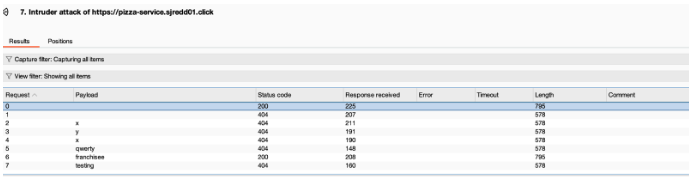
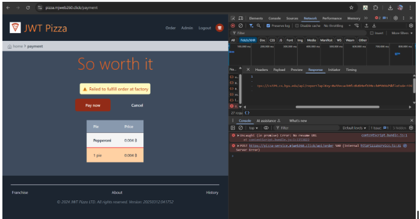
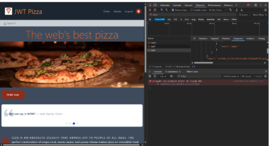
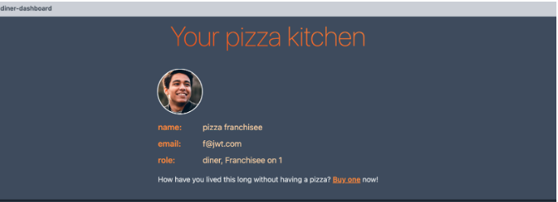

Samuel Redd and Micah Jensen

Sam self attack
Date: 4/10/25
Target: pizza.sjredd01.click
Classification:Identification and Authentication failure
Description: Did a sniper attack and found usable passwords

Correction: Same as the attack on Micah, don’t respond with passwords. To keep security high. Only respond 200 with nothing else.

Micah Self Attack
Date 4/10/25
Target: pizza.mjweb260.click
Classification: Cryptographic Failure
Description: Caused a pizza order failure, response from server contained api key for pizza factory api

Correction: Sanitize error messages to not contain API key

Micah attack on Sam:
Date: 4/10/25
Target: pizza.sjredd01.click
Classification: Security Misconfiguration
Severity: High
Description: Signed in as Admin using default, easy to guess credentials. Grabbed auth token using Inspect. Could've flooded endpoints with requests to create pizza and franchises (but didn't to keep AWS bill down)

Corrections: Remove default admin account

Sam attack on Micah
Date: 4/10/25
Target: https://pizza.mjweb260.click/
Classification: Identification and Authentication Failure
Severity: 3
Description: Brute force attack revealed a franchisee password

Corrections: Make sure a successful response does not have the password or username returned.

Combined summary of learning
We learned that the importance of user side security, easy usernames and passwords make it easy to steal. Have to make strong passwords, especially those with admin privileges or those that can change a system. It's easy to see why websites use two factor authentication with email or confirm with text.
